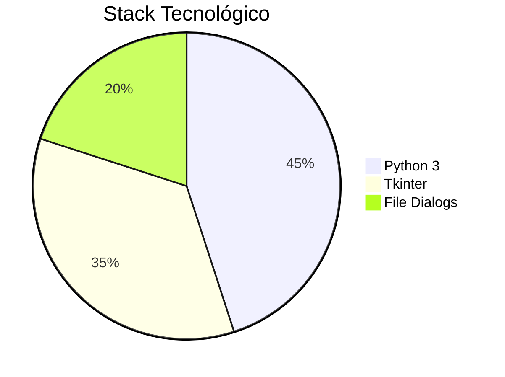

# 📝 **PyText Editor** - Editor de Texto Minimalista


> *" - Edición de texto sin distracciones"*

## 🚀 **Características Principales**
- ✅ Interfaz gráfica limpia con **Tkinter**
- 📂 Soporte para abrir/guardar archivos `.txt`
- 🖍️ Sintaxis básica (planeado en futuras versiones)
- 🧰 Menú contextual con atajos esenciales

## 🎮 **Cómo Usarlo**
```bash
# Requisitos previos
pip install python==3.8+

# Ejecución
python editor_texto.py
```

## 💻 **Tecnologías Utilizadas**

